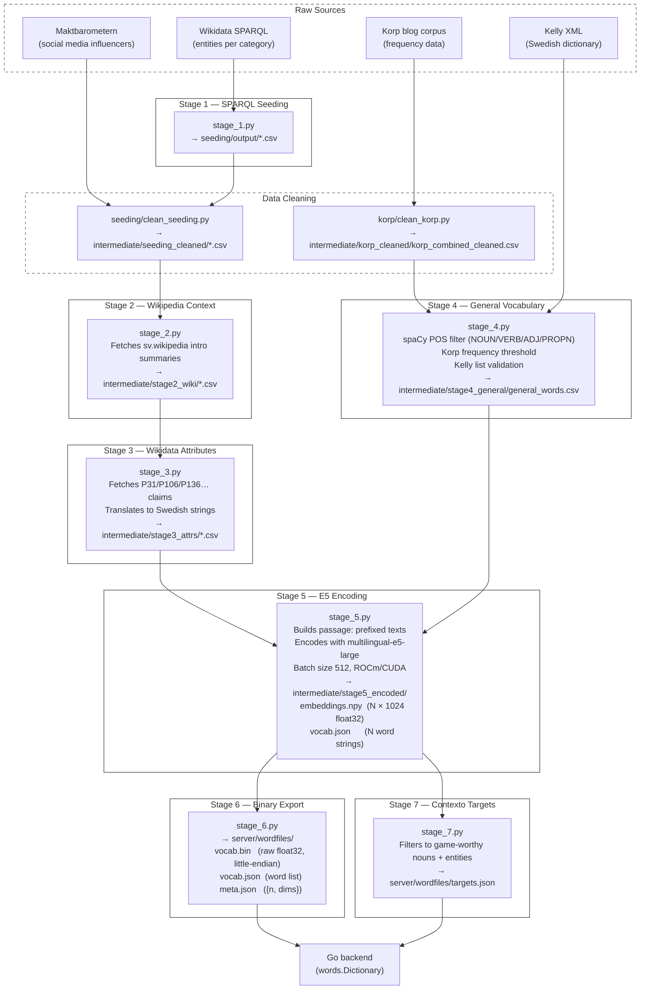

# Preprocessing Pipeline

This directory contains the NLP pipeline that builds the word embeddings used by the game server. The pipeline is based on **`intfloat/multilingual-e5-large`** — a 1024-dimensional multilingual transformer model — replacing the earlier FastText approach.

The core idea is to give the model _context_, not just naked words. Named entities (celebrities, companies, games, etc.) are enriched with Swedish Wikipedia summaries and Wikidata attribute strings before encoding, so the model understands that "Zlatan" is a footballer, not just a string of characters.

State is passed between stages via files in `intermediate/` (git-ignored). The final output lands in `server/wordfiles/` where the Go backend loads it at startup.

---

## Prerequisites & Setup

1. **Environment variables**

   Create `.env.local` in this directory:

   ```bash
   MAIL=your-email@example.com   # used as User-Agent for SPARQL / Wikimedia API requests
   ```

2. **spaCy Swedish model**

   ```bash
   python -m spacy download sv_core_news_sm
   ```

3. **Python dependencies**

   ```bash
   pip install -r requirements.txt
   ```

   Key packages: `sentence-transformers`, `torch` (with ROCm for AMD GPU or CUDA for NVIDIA), `spacy`, `pandas`, `requests`.

4. **Korp frequency data**

   Place raw Korp CSV files inside [`korp/`](korp). The cleaning step runs automatically the first time.

<!-- 4. **AMD GPU (ROCm)**

   The pipeline assumes a ROCm-enabled PyTorch installation. Stage 5 auto-detects `cuda` via `torch.cuda.is_available()` and falls back to CPU if unavailable — it will just be slower. -->

---

## Running the Pipeline

Stages must be run in order from the `preprocessing/` directory. Each stage is idempotent — re-running a completed stage skips already-processed files.

```bash
# Data cleaning (run once, or after updating raw source files)
python -m korp.clean_korp
python -m seeding.clean_seeding   # also handles Maktbarometern

# Main pipeline
python stage_1.py   # SPARQL → seeding/output/
python stage_2.py   # Wikipedia summaries → intermediate/stage2_wiki/
python stage_3.py   # Wikidata attributes → intermediate/stage3_attrs/
python stage_4.py   # Korp + Kelly + spaCy → intermediate/stage4_general/
python stage_5.py   # E5 encoding → intermediate/stage5_encoded/
python stage_6.py   # Binary export → server/wordfiles/
python stage_7.py   # Curated targets → server/wordfiles/targets.json
```

### Logging

- **Terminal:** High-level progress only (warnings and above).
- **`pipeline.log`:** Full diagnostics, row counts, API errors, and timing. Check this file when a stage fails.

---

## Pipeline Overview



---

## Shared Configuration — [`shared.py`](shared.py)

All stages import constants and loaders from here. Key exports:

| Symbol                    | Purpose                                            |
| ------------------------- | -------------------------------------------------- |
| `BASE_DIR`                | Absolute path to this directory                    |
| `INTERMEDIATE_DIR`        | `intermediate/` — stage-to-stage scratch space     |
| `SEEDING_CLEANED_DIR`     | `intermediate/seeding_cleaned/` — cleaned CSVs     |
| `CLEANED_KORP_DIR`        | `intermediate/korp_cleaned/` — merged Korp file    |
| `OUTPUT_DIR`              | `server/wordfiles/` — final output for Go          |
| `DEFAULT_KORP_FREQ`       | Minimum Korp frequency for general words (300)     |
| `ALLOWED_POS`             | `{NOUN, PROPN, VERB, ADJ}`                         |
| `read_korp()`             | Loads `korp_combined_cleaned.csv` as list of dicts |
| `load_kelly()`            | Parses `kelly.xml` into a word set (cached)        |
| `load_custom_stopwords()` | Loads all CSVs from `stopwords/` (cached)          |
| `load_seeding()`          | Loads all CSVs from `seeding_cleaned/`             |
| `load_spacy()`            | Loads `sv_core_news_sm` with parser/NER disabled   |

---

## Stage Architecture

### Data Cleaning

These run automatically on first pipeline execution, or manually if source data changes.

**`korp/clean_korp.py`**

Reads raw Korp CSV files from `korp/`, filters to valid Swedish words (regex, minimum frequency, length checks), merges all files, and writes `intermediate/korp_cleaned/korp_combined_cleaned.csv` with schema `word, Totalt`.

**`seeding/clean_seeding.py`**

- Processes Maktbarometern influencer CSVs from `seeding/maktbarometern/csv/` — normalises Unicode (NFKC), strips emojis and full-width characters, deduplicates by name, sorts by score.
- Processes SPARQL output CSVs from `seeding/output/` — resolves raw Wikidata Q-IDs to Swedish labels via the Wikidata API, cleans text, drops duplicates.
- Outputs all cleaned files to `intermediate/seeding_cleaned/`.

---

### Stage 1 — SPARQL Seeding [`stage_1.py`](stage_1.py)

Queries Wikidata via SPARQL to fetch named entities grouped by category (Swedish celebrities, companies, video games, food, geography, TV/film, culture). Uses query definitions from [`seeding/queries/`](seeding/queries).

- **Output:** `seeding/output/*.csv` — one file per category, with columns like `personLabel`, `sitelinks`, etc.

---

### Stage 2 — Wikipedia Context [`stage_2.py`](stage_2.py)

For each entity in the cleaned seeding CSVs, fetches the introductory paragraph from **Swedish Wikipedia** (`sv.wikipedia.org`). This gives the E5 model rich contextual prose — "Minecraft är ett sandlådespel…" is far more informative than the bare word "Minecraft".

Includes resume support: already-processed files are skipped, so the stage can safely be interrupted and restarted.

- **Reads:** `intermediate/seeding_cleaned/*.csv`
- **Output:** `intermediate/stage2_wiki/*.csv` — same schema plus a `wiki_summary` column

---

### Stage 3 — Wikidata Attributes [`stage_3.py`](stage_3.py)

Fetches structured Wikidata P-claims for each entity and translates them into readable Swedish attribute strings. This supplements sparse Wikipedia summaries with categorical facts.

Properties fetched:

| Property | Swedish label | Example output                 |
| -------- | ------------- | ------------------------------ |
| P31      | Typ           | `Typ: datorspel.`              |
| P106     | Yrke          | `Yrke: skådespelare, sångare.` |
| P136     | Genre         | `Genre: action.`               |
| P452     | Bransch       | `Bransch: detaljhandel.`       |
| P178     | Utvecklare    | `Utvecklare: Mojang.`          |
| P641     | Sport         | `Sport: fotboll.`              |

Files without Wikidata Q-ID columns (e.g. Maktbarometern) pass through unchanged with an empty `wiki_attributes` column.

- **Reads:** `intermediate/stage2_wiki/*.csv`
- **Output:** `intermediate/stage3_attrs/*.csv` — adds a `wiki_attributes` column

---

### Stage 4 — General Vocabulary [`stage_4.py`](stage_4.py)

Builds the base Swedish dictionary from Korp frequency data. This covers everyday words (nouns, verbs, adjectives) that are not named entities.

Pipeline:

1. Load Korp rows, keep only those with `Totalt >= 300`
2. Drop custom stopwords (loaded from `stopwords/`)
3. Run spaCy POS tagging — keep `NOUN`, `VERB`, `ADJ`, `PROPN` only
4. Drop spaCy-identified stopwords
5. Cross-reference lemmas against the Kelly Swedish dictionary

- **Reads:** `korp_cleaned/korp_combined_cleaned.csv`, `kelly.xml`, `stopwords/*.csv`
- **Output:** `intermediate/stage4_general/general_words.csv` — columns: `word, lemma, pos, Totalt, in_kelly`

---

### Stage 5 — E5 Encoding [`stage_5.py`](stage_5.py)

The core stage. Merges entity and word data, constructs `passage:`-prefixed text inputs, and encodes everything with `intfloat/multilingual-e5-large`.

**Passage format:**

- Entities: `passage: <Name>. <wiki_summary>. <wiki_attributes>`
- General words: `passage: <word>`

Entities take priority — if a general word overlaps with a known entity (e.g. "Stockholm"), the richer entity passage is used and the naked word form is dropped.

All vectors are **L2-normalised** so that cosine similarity equals a simple dot product at runtime — no `sqrt` needed in the Go backend.

Configuration:

- Batch size: 512
- Device: `cuda` (ROCm/CUDA) with CPU fallback
- Summary truncated to 1 500 chars to stay within E5's 512-token limit

- **Reads:** `intermediate/stage3_attrs/*.csv`, `intermediate/stage4_general/general_words.csv`
- **Output:**
  - `intermediate/stage5_encoded/embeddings.npy` — float32, shape (N, 1024)
  - `intermediate/stage5_encoded/vocab.json` — list of N word strings, same row order

---

### Stage 6 — Binary Export [`stage_6.py`](stage_6.py)

Converts the numpy embeddings into a compact binary format that the Go backend can load instantly via `encoding/binary`. Avoids parsing gigabytes of CSV floats at server startup.

**Output files in `server/wordfiles/`:**

| File         | Contents                                                    |
| ------------ | ----------------------------------------------------------- |
| `vocab.bin`  | Raw little-endian float32, N × 1024 bytes                   |
| `vocab.json` | JSON list of N word strings (same order as rows)            |
| `meta.json`  | `{"n": N, "dims": 1024}` — shape metadata for the Go loader |

A round-trip sanity check is run before exit: the first vector is re-read from disk and compared against the original numpy array.

- **Reads:** `intermediate/stage5_encoded/embeddings.npy`, `intermediate/stage5_encoded/vocab.json`
- **Output:** `server/wordfiles/vocab.bin`, `vocab.json`, `meta.json`

---

### Stage 7 — Contexto Target List [`stage_7.py`](stage_7.py)

Not all words make good Contexto targets — function words, rare technical terms, and ambiguous short words all make for a bad game experience. This stage filters the full vocabulary down to a curated list of concrete, recognisable Swedish words.

Criteria for **general words:** POS = `NOUN`, Korp frequency ≥ 1 000, present in Kelly, length 4–20 characters.

Criteria for **entities:** must have at least some Wikipedia summary or Wikidata attributes, length 4–20 characters.

Both lists are additionally filtered against `stage5_encoded/vocab.json` to ensure only actually-encoded words are included.

- **Reads:** `intermediate/stage4_general/general_words.csv`, `intermediate/stage3_attrs/*.csv`, `intermediate/stage5_encoded/vocab.json`
- **Output:** `server/wordfiles/targets.json` — sorted JSON list of target word strings

At game start the Go backend calls `dictionary.SetRandomContextoTarget()`, which picks a random entry from this list and sets it as the active word. Real-time cosine similarity is computed on-the-fly via dot product — no precomputed rank matrix is needed.

---

## Go Backend Integration

The Go server (`server/words/`) auto-detects the new binary format on startup:

1. If `vocab.bin` + `vocab.json` + `meta.json` exist → load binary (fast path)
2. Otherwise → fall back to legacy `*_vectors.csv` files

The binary loader lives in `server/words/readbinary.go`. After loading, the in-memory `Dictionary` is identical in structure to before — all game logic (`CalculateDistance`, `RandomRelatedPair`, etc.) is unchanged.

For player guesses the backend must prepend **`query:`** to the input before embedding and comparison. This is the E5 query/passage asymmetry: passages are indexed with `passage:`, queries are issued with `query:`.

> **Note:** The current `CalculateDistance` implementation compares stored vectors directly (dot product, since they are L2-normalised). Player inputs are validated against the dictionary (`IsValid`) but are not re-encoded at runtime — they are looked up by key. Live re-encoding of arbitrary player input is a future enhancement.
