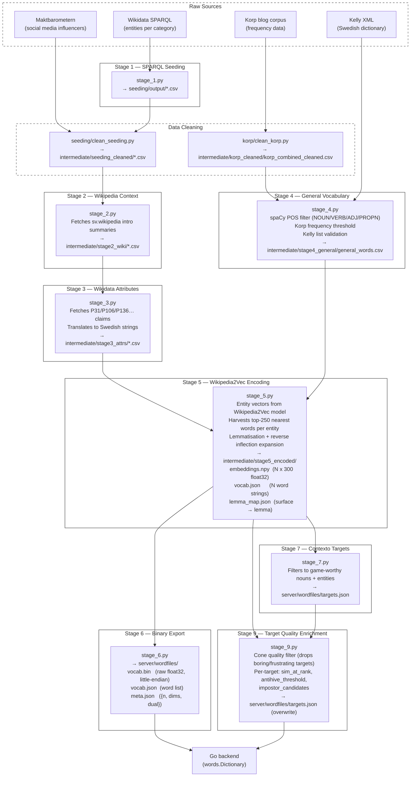

# Preprocessing Pipeline

This directory contains the NLP pipeline that builds the word embeddings used by the game server. The pipeline is based on **Wikipedia2Vec** trained on Swedish Wikipedia (`svwiki-w2v-300d`, 300-dimensional), replacing earlier approaches based on FastText and sentence transformers.

The core idea is that Wikipedia2Vec places both *words* and *named entities* in the same vector space. This means "Zlatan" as an entity and "fotboll" as a word end up near each other naturally — no manual context enrichment required at encode time.

State is passed between stages via files in `intermediate/` (git-ignored). The final output lands in `server/wordfiles/` where the Go backend loads it at startup.

---

## Prerequisites & Setup

1. **Environment variables**

   Create `.env.local` in this directory:

   ```bash
   MAIL=your-email@example.com   # used as User-Agent for SPARQL / Wikimedia API requests
   ```

2. **spaCy Swedish model**

   ```bash
   python -m spacy download sv_core_news_sm
   ```

3. **Python dependencies**

   ```bash
   pip install -r requirements.txt
   ```

   Key packages: `wikipedia2vec`, `spacy`, `pandas`, `requests`, `numpy`.

4. **Wikipedia2Vec model**

   The trained model file (`svwiki-w2v-300d.bin`, ~3–4 GB) must be placed at `preprocessing/model/svwiki-w2v-300d.bin`. See `plan.md` for training instructions if you need to retrain it.

5. **Korp frequency data**

   Place raw Korp CSV files inside [`korp/`](korp). The cleaning step runs automatically the first time.

---

## Running the Pipeline

Stages must be run in order from the `preprocessing/` directory. Each stage is idempotent — re-running a completed stage skips already-processed files.

```bash
# Data cleaning (run once, or after updating raw source files)
python -m korp.clean_korp
python -m seeding.clean_seeding   # also handles Maktbarometern

# Main pipeline
python stage_1.py   # SPARQL → seeding/output/
python stage_2.py   # Wikipedia summaries → intermediate/stage2_wiki/
python stage_3.py   # Wikidata attributes → intermediate/stage3_attrs/
python stage_4.py   # Korp + Kelly + spaCy → intermediate/stage4_general/
python stage_5.py   # Wikipedia2Vec encoding → intermediate/stage5_encoded/
python stage_6.py   # Binary export → server/wordfiles/
python stage_7.py   # Curated targets → server/wordfiles/targets.json
python stage_9.py   # Target quality enrichment → server/wordfiles/targets.json (overwrite)
```

### Logging

- **Terminal:** High-level progress only (warnings and above).
- **`pipeline.log`:** Full diagnostics, row counts, API errors, and timing. Check this file when a stage fails.

---

## Pipeline Overview



---

## Shared Configuration — [`shared.py`](shared.py)

All stages import constants and loaders from here. Key exports:

| Symbol                    | Purpose                                            |
| ------------------------- | -------------------------------------------------- |
| `BASE_DIR`                | Absolute path to this directory                    |
| `INTERMEDIATE_DIR`        | `intermediate/` — stage-to-stage scratch space     |
| `SEEDING_CLEANED_DIR`     | `intermediate/seeding_cleaned/` — cleaned CSVs     |
| `CLEANED_KORP_DIR`        | `intermediate/korp_cleaned/` — merged Korp file    |
| `OUTPUT_DIR`              | `server/wordfiles/` — final output for Go          |
| `DEFAULT_KORP_FREQ`       | Minimum Korp frequency for general words (300)     |
| `ALLOWED_POS`             | `{NOUN, PROPN, VERB, ADJ}`                         |
| `read_korp()`             | Loads `korp_combined_cleaned.csv` as list of dicts |
| `load_kelly()`            | Parses `kelly.xml` into a word set (cached)        |
| `load_custom_stopwords()` | Loads all CSVs from `stopwords/` (cached)          |
| `load_seeding()`          | Loads all CSVs from `seeding_cleaned/`             |
| `load_spacy()`            | Loads `sv_core_news_sm` with parser/NER disabled   |

---

## Stage Architecture

### Data Cleaning

These run automatically on first pipeline execution, or manually if source data changes.

**`korp/clean_korp.py`**

Reads raw Korp CSV files from `korp/`, filters to valid Swedish words (regex, minimum frequency, length checks), merges all files, and writes `intermediate/korp_cleaned/korp_combined_cleaned.csv` with schema `word, Totalt`.

**`seeding/clean_seeding.py`**

- Processes Maktbarometern influencer CSVs from `seeding/maktbarometern/csv/` — normalises Unicode (NFKC), strips emojis and full-width characters, deduplicates by name, sorts by score.
- Processes SPARQL output CSVs from `seeding/output/` — resolves raw Wikidata Q-IDs to Swedish labels via the Wikidata API, cleans text, drops duplicates.
- Outputs all cleaned files to `intermediate/seeding_cleaned/`.

---

### Stage 1 — SPARQL Seeding [`stage_1.py`](stage_1.py)

Queries Wikidata via SPARQL to fetch named entities grouped by category (Swedish celebrities, companies, video games, food, geography, TV/film, culture). Uses query definitions from [`seeding/queries/`](seeding/queries).

- **Output:** `seeding/output/*.csv` — one file per category, with columns like `personLabel`, `sitelinks`, etc.

---

### Stage 2 — Wikipedia Context [`stage_2.py`](stage_2.py)

For each entity in the cleaned seeding CSVs, fetches the introductory paragraph from **Swedish Wikipedia** (`sv.wikipedia.org`). This is used for display context and Wikidata enrichment in later stages. Wikipedia2Vec already internalised Wikipedia content during training, so this data is not needed for embedding — it is used by stage 3 to supplement entity records.

Includes resume support: already-processed files are skipped, so the stage can safely be interrupted and restarted.

- **Reads:** `intermediate/seeding_cleaned/*.csv`
- **Output:** `intermediate/stage2_wiki/*.csv` — same schema plus a `wiki_summary` column

---

### Stage 3 — Wikidata Attributes [`stage_3.py`](stage_3.py)

Fetches structured Wikidata P-claims for each entity and translates them into readable Swedish attribute strings. Used alongside stage 2 data to enrich entity records stored in `stage3_attrs/`.

Properties fetched:

| Property | Swedish label | Example output                 |
| -------- | ------------- | ------------------------------ |
| P31      | Typ           | `Typ: datorspel.`              |
| P106     | Yrke          | `Yrke: skådespelare, sångare.` |
| P136     | Genre         | `Genre: action.`               |
| P452     | Bransch       | `Bransch: detaljhandel.`       |
| P178     | Utvecklare    | `Utvecklare: Mojang.`          |
| P641     | Sport         | `Sport: fotboll.`              |

Files without Wikidata Q-ID columns (e.g. Maktbarometern) pass through unchanged with an empty `wiki_attributes` column.

- **Reads:** `intermediate/stage2_wiki/*.csv`
- **Output:** `intermediate/stage3_attrs/*.csv` — adds a `wiki_attributes` column

---

### Stage 4 — General Vocabulary [`stage_4.py`](stage_4.py)

Builds the base Swedish dictionary from Korp frequency data. This covers everyday words (nouns, verbs, adjectives) that are not named entities.

Pipeline:

1. Load Korp rows, keep only those with `Totalt >= 300`
2. Drop custom stopwords (loaded from `stopwords/`)
3. Run spaCy POS tagging — keep `NOUN`, `VERB`, `ADJ`, `PROPN` only
4. Drop spaCy-identified stopwords
5. Cross-reference lemmas against the Kelly Swedish dictionary

- **Reads:** `korp_cleaned/korp_combined_cleaned.csv`, `kelly.xml`, `stopwords/*.csv`
- **Output:** `intermediate/stage4_general/general_words.csv` — columns: `word, lemma, pos, Totalt, in_kelly`

---

### Stage 5 — Wikipedia2Vec Encoding [`stage_5.py`](stage_5.py)

The core stage. Loads `svwiki-w2v-300d.bin` (the Wikipedia2Vec model trained on Swedish Wikipedia) and uses it to build the vocabulary and embeddings.

**How entity vectors are harvested:**

1. For each entity in `stage3_attrs/`, look up its entity vector directly from the Wikipedia2Vec model.
2. Batch matrix-multiply all entity vectors against the full model word matrix to get cosine similarities.
3. Keep the top 250 nearest words per entity (threshold: cosine sim ≥ 0.15). Each word keeps its best similarity score across all entities.
4. If the word bank is still below `TARGET_VOCAB_SIZE` (80 000), supplement with high-frequency Korp words.

**Lemmatisation and inflection expansion:**

- Every word in the bank is forward-lemmatised via spaCy (`sv_core_news_sm`). The canonical key in the vocab is the lemma.
- A reverse lookup then adds all attested Korp inflected forms of each lemma (e.g., if `bil` is in the bank, `bilar`, `bilens`, `bilarna` are added too). Inflected forms share the same vector as their lemma.
- The surface→lemma mapping is exported as `lemma_map.json` so the Go backend can resolve player input at runtime.

All vectors are **L2-normalised** so cosine similarity equals a dot product — no `sqrt` needed in the Go backend.

- **Reads:** `intermediate/stage3_attrs/*.csv`, `model/svwiki-w2v-300d.bin`
- **Output:**
  - `intermediate/stage5_encoded/embeddings.npy` — float32, shape (N, 300)
  - `intermediate/stage5_encoded/vocab.json` — list of N word strings, same row order
  - `intermediate/stage5_encoded/sources.json` — category per entry ("celebrity", "game", …, "general")
  - `intermediate/stage5_encoded/lemma_map.json` — `{surface_form: lemma}` for all attested inflections

---

### Stage 6 — Binary Export [`stage_6.py`](stage_6.py)

Converts the numpy embeddings into a compact binary format that the Go backend can load instantly via `encoding/binary`. Avoids parsing large CSV floats at server startup.

Wikipedia2Vec is a symmetric embedding space (words and entities share one matrix, no query/passage distinction), so `dual` is always `false` and only one embedding file is written.

**Output files in `server/wordfiles/`:**

| File             | Contents                                                     |
| ---------------- | ------------------------------------------------------------ |
| `vocab.bin`      | Raw little-endian float32, N x 300 bytes                     |
| `vocab.json`     | JSON list of N word strings (same order as rows)             |
| `meta.json`      | `{"n": N, "dims": 300, "dual": false}` -- shape metadata     |
| `sources.json`   | Category label per entry (if produced by stage 5)            |
| `lemma_map.json` | Surface-to-lemma map for Go runtime resolution               |

A round-trip sanity check is run before exit: the first vector is re-read from disk and compared against the original numpy array.

- **Reads:** `intermediate/stage5_encoded/embeddings.npy`, `intermediate/stage5_encoded/vocab.json`
- **Output:** `server/wordfiles/vocab.bin`, `vocab.json`, `meta.json`, `sources.json`, `lemma_map.json`

---

### Stage 7 — Contexto Target List [`stage_7.py`](stage_7.py)

Not all words make good Contexto targets — function words, rare technical terms, and ambiguous short words all make for a bad game experience. This stage filters the full vocabulary down to a curated list of concrete, recognisable Swedish words.

Criteria for **general words:** POS = `NOUN`, Korp frequency ≥ 1 000, present in Kelly, length 4–20 characters.

Criteria for **entities:** must have at least some Wikipedia summary or Wikidata attributes, length 4–20 characters.

Both lists are additionally filtered against `stage5_encoded/vocab.json` to ensure only actually-encoded words are included.

- **Reads:** `intermediate/stage4_general/general_words.csv`, `intermediate/stage3_attrs/*.csv`, `intermediate/stage5_encoded/vocab.json`
- **Output:** `server/wordfiles/targets.json` — sorted JSON list of target word strings

At game start the Go backend calls `dictionary.SetRandomContextoTarget()`, which picks a random entry from this list and sets it as the active word. Real-time cosine similarity is computed on-the-fly via dot product — no precomputed rank matrix is needed.

---

### Stage 9 — Target Quality Enrichment [`stage_9.py`](stage_9.py)

Overwrites `targets.json` with a richer format. For every target it computes the full cosine-similarity ranking across the whole vocabulary and attaches three pieces of metadata:

**`sim_at_rank`** — similarity values at ranks 10, 50, 100, 500, 1000. Lets the Contexto UI show calibrated hot/warm/cold hints that are consistent across all target words (a rank-200 guess near "Fotboll" means something different than rank-200 near "Avicii").

**`antihive_threshold`** — cosine distance at rank 500 for this specific target. Replaces the single global `MaxDistance: 0.6` constant in Anti-Hivemind mode with a threshold that reflects the natural density of each word's neighborhood.

**`impostor_candidates`** — up to 12 same-category words with similarity in `[0.50, 0.80]`. Impostor mode picks from here rather than running a runtime search, removing the 8-attempt retry failure mode.

**Cone quality filter** — targets are dropped if their similarity distribution is too concentrated (`sim@10 − sim@500 < 0.06`, meaning all words feel equally close) or too diffuse (`sim@10 − sim@500 > 0.72`, meaning almost nothing is near the target). Tunable at the top of the script.

- **Reads:** `intermediate/stage5_encoded/embeddings.npy`, `vocab.json`, `sources.json`, `lemma_map.json`; `server/wordfiles/targets.json`
- **Output:** `server/wordfiles/targets.json` — same word list, filtered and enriched

---

## Go Backend Integration

The Go server (`server/words/`) auto-detects the binary format on startup:

1. If `vocab.bin` + `vocab.json` + `meta.json` exist → load binary (fast path)
2. Otherwise → fall back to legacy `*_vectors.csv` files

The binary loader lives in `server/words/readbinary.go`. After loading, the in-memory `Dictionary` is identical in structure to before — all game logic (`CalculateDistance`, `RandomRelatedPair`, etc.) is unchanged.

Because Wikipedia2Vec is a symmetric space, player guesses are looked up directly by key (via `LemmaMap` resolution). There is no query/passage asymmetry to handle — the same vector is used whether a word is a target or a guess.
