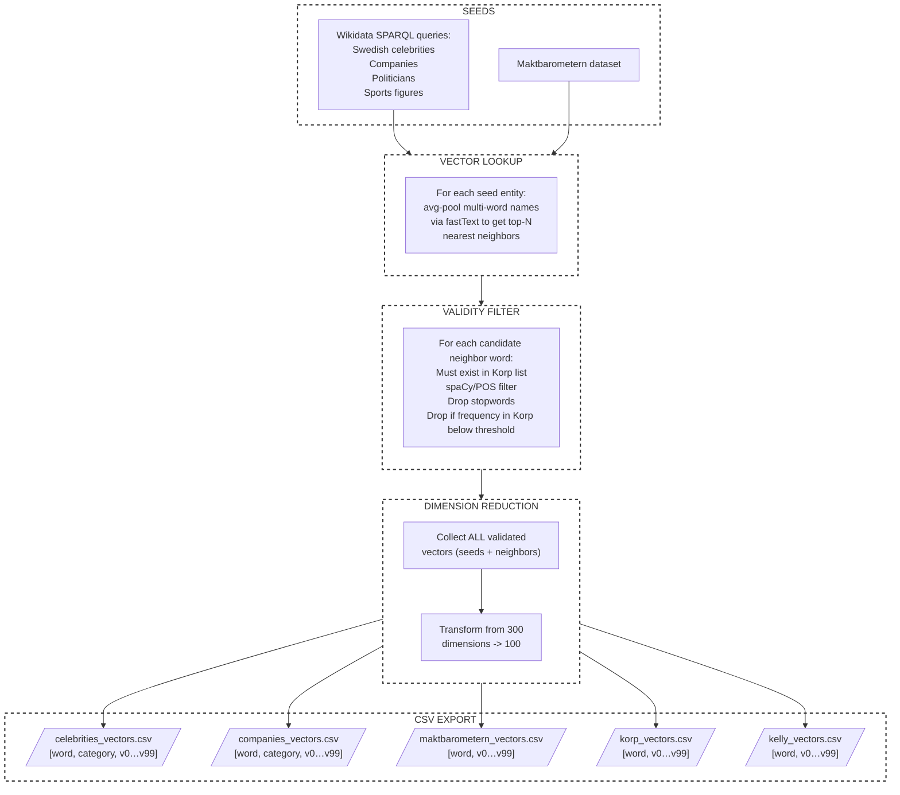

# Word Preprocessing - Python

## Overview of the pipeline

```mermaid
flowchart TD
    subgraph S1 [SEEDS]
        direction TB
        WD["Wikidata SPARQL queries:<br>Swedish celebrities<br>Companies<br>Politicians<br>Sports figures"]
        MB["Maktbarometern dataset"]
    end

    subgraph S2 [VECTOR LOOKUP]
        direction TB
        VL1["For each seed entity:<br>avg-pool multi-word names<br>via fastText to get top-N <br>nearest neighbors"]
    end

    %% STAGE 3
    subgraph S3 [VALIDITY FILTER]
        direction TB
        VF1["For each candidate neighbor word:<br>Must exist in Korp list<br>spaCy/POS filter<br>Drop stopwords<br>Drop if frequency in Korp <br>below threshold"]
    end

    %% STAGE 4
    subgraph S4 [DIMENSION REDUCTION]
        direction TB
        DR1["Collect ALL validated<br>vectors (seeds + neighbors)"]
        DR2["Transform from 300 <br> dimensions -> 100"]

        DR1 --> DR2
    end

    %% STAGE 5
    subgraph S5 [CSV EXPORT]
        direction TB
        CSV1[/"celebrities_vectors.csv<br>[word, category, v0…v99]"/]
        CSV2[/"companies_vectors.csv<br>[word, category, v0…v99]"/]
        CSV3[/"maktbarometern_vectors.csv<br>[word, v0…v99]"/]
        CSV4[/"korp_vectors.csv<br>[word, v0…v99]"/]
        CSV5[/"kelly_vectors.csv<br>[word, v0…v99]"/]
    end

    %% Flow connections
    WD & MB --> S2
    S2 --> S3
    S3 --> S4
    S4 --> CSV1 & CSV2 & CSV3 & CSV4 & CSV5

    %% Styling to match the grouped aesthetic
    style S1 fill:transparent,stroke:#333,stroke-width:2px,stroke-dasharray: 5 5
    style S2 fill:transparent,stroke:#333,stroke-width:2px,stroke-dasharray: 5 5
    style S3 fill:transparent,stroke:#333,stroke-width:2px,stroke-dasharray: 5 5
    style S4 fill:transparent,stroke:#333,stroke-width:2px,stroke-dasharray: 5 5
    style S5 fill:transparent,stroke:#333,stroke-width:2px,stroke-dasharray: 5 5

    %% FILE REFERENCES
    click WD "https://github.com/Skill-issue-coding/WordGame---TDDD27-Project/tree/word-processing/preprocessing/sparql/sparql.py" "Click to view file"
    click MB "./maktbarometern/" "Click to view file"
```
