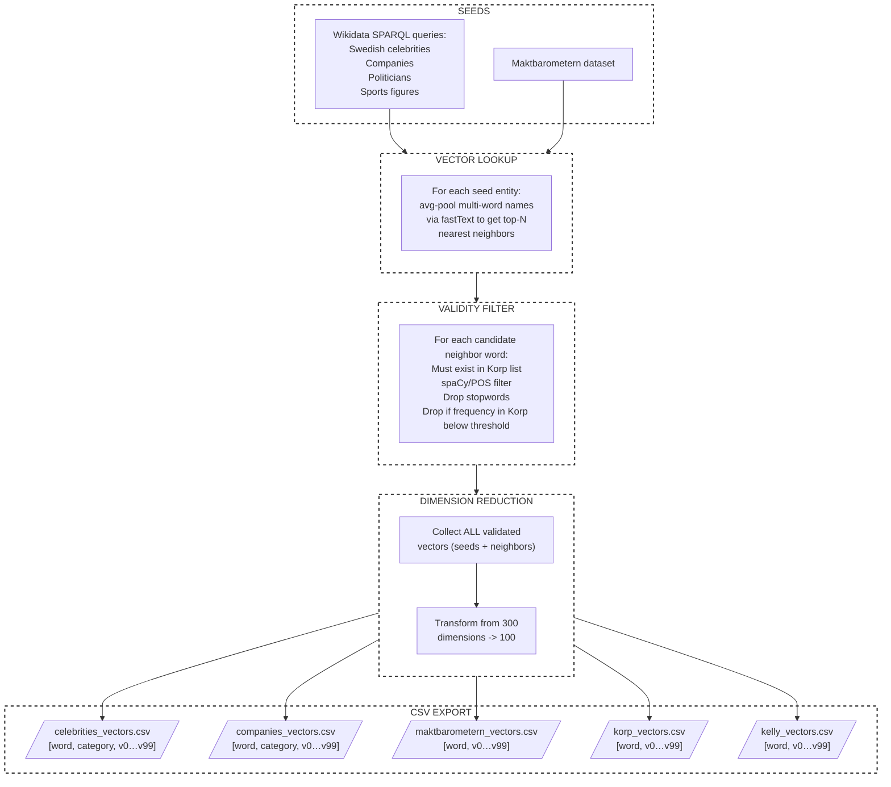

# Preprocessing Pipeline

This directory contains the 5-stage NLP pipeline used to generate, validate, and reduce the vector representations of words (entities) used in the game.

The pipeline has been split into independent, sequentially runnable stages to improve modularity and debugging. State is passed between stages via `.pkl` files stored in the `intermediate/` directory. The `intermediate/` is ignored by the `.gitignore`.

## Prerequisites & Setup

Before running the pipeline, ensure you have the required models and environment variables set up:

1. **Environment Variables:** Create a `.env.local` file in the `preprocessing` directory containing your Wikidata email (for SPARQL query compliance):

   ```bash
   MAIL=your-email@example.com
   ```

2. **FastText Model:** Download a model from [Språkbanken](https://spraakbanken.gu.se/en/resources/kubord-fasttext) and place it in the `preprocessing/` root.

3. **spaCy Model:** Install the Swedish language model for spaCy:

   ```bash
   python -m spacy download sv_core_news_sm
   ```

4. **Korp Frequency Data:** Ensure your Korp CSV files are placed inside the [`preprocessing/korp/`](korp) directory.

5. Requirements.txt

   Pip install everything from the requirements.txt

   ```bash
   pip install -r requirements.txt
   ```

## Running the Pipeline

You can run each stage independently. They must be executed in order, as each stage relies on the output of the previous one.

```bash
# Run the full pipeline step-by-step
python stage_1.py
python stage_2.py
python stage_3.py
python stage_4.py
python stage_5.py
```

### Logging

The pipeline features a split-logging architecture:

- **Terminal:** Clean, minimalist high-level progress (e.g., "Starting stage 1...", "Success").

- **File (**`pipeline.log`**):** Deep, detailed diagnostics, error traces, and processing metrics. Check this file if a stage fails.

## Overview of the pipeline



## Stage Architecture

### [`shared.py`](shared.py)

Contains the shared configuration, paths, model loaders (fastText, spaCy, Korp), and the logging setup. All stages import their baseline configurations from here.

### Stage 1: SPARQL Seeding [`stage_1.py`](stage_1.py)

Queries Wikidata to fetch seed entities (celebrities, companies, video games, etc.) based on the `.sparql` files in [`seeding/queries/`](seeding/queries).

- **Outputs:** Raw `.csv` files saved to [`seeding/output/*.csv`](seeding/output).

### Stage 2: Vector Lookup [`stage_2.py`](stage_2.py)

Reads the Stage 1 CSVs and finds the nearest fastText vector neighbours for each seed entity. Multi-word seeds are average-pooled before lookup. _This stage takes a long time cause of the mathematical calculations_

- **Reads:** [`seeding/output/*.csv`](seeding/output)

- **Outputs:** `intermediate/stage2_candidates.pkl`

### Stage 3: Validity Filter [`stage_3.py`](stage_3.py)

Filters the candidate words generated in Stage 2 to ensure they are valid game words. Drops words based on length, spaCy Part-of-Speech tagging (must be `NOUN` or `PROPN`), stopwords, and minimum Korp corpus frequency.

- **Reads:** `intermediate/stage2_candidates.pkl`

- **Outputs:** `intermediate/stage3_validated.pkl`

### Stage 4: Dimension Reduction [`stage_4.py`](stage_4.py)

Performs Principal Component Analysis (PCA) independently per category file. Reduces the 300-dimensional fastText vectors down to 100 dimensions to optimize client delivery and semantic variance for that specific category.

- **Reads:** `intermediate/stage3_validated.pkl`

- **Outputs:** `intermediate/stage4_reduced.pkl`

### Stage 5: CSV Export [`stage_5.py`](stage_5.py)

Formats the final validated, dimensionality-reduced data and writes it to the server's static directory.

- **Reads:** `intermediate/stage4_reduced.pkl`

- Outputs: Final `*_vectors.csv` files saved to [`server/wordfiles/`](../server/wordfiles).
