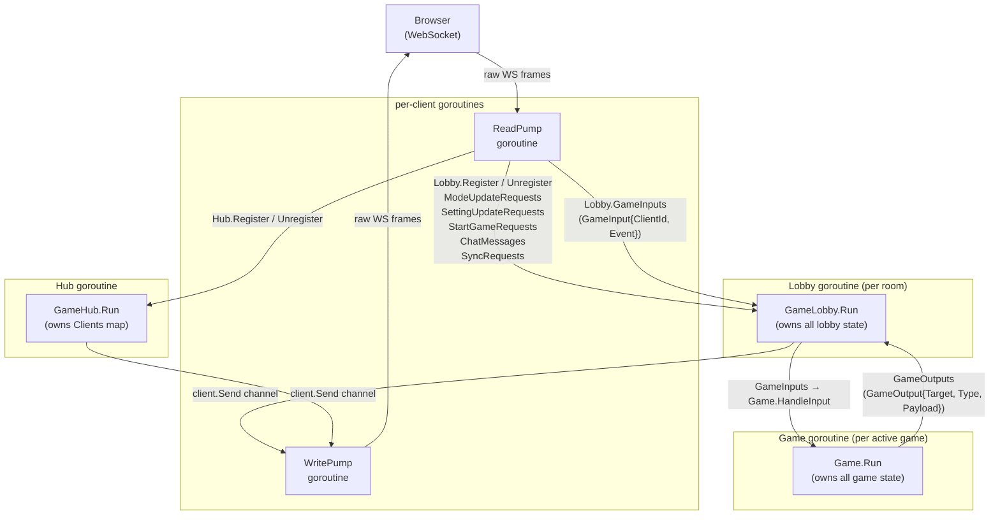
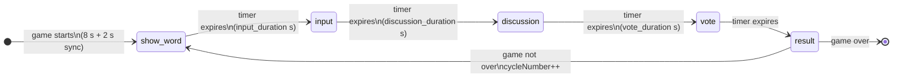
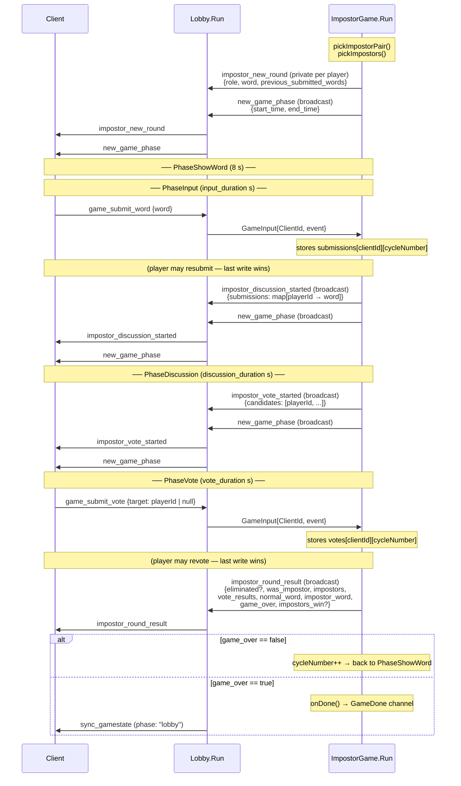

# Game Package — Architecture & Protocol

This document covers the complete message flow from the frontend WebSocket connection through
the server's goroutine topology, down to the active game and back.

---

## Goroutine & Channel Topology

Every layer owns its state exclusively through a single goroutine. Goroutines communicate
only via typed channels — no shared-memory locks except the hub's `LobbiesMutex` (used
only by HTTP upgrade handlers that run outside the hub goroutine).



A `nil` `GameOutput.Target` means broadcast to all clients in the lobby.  
A non-nil `Target` means send privately to that one player.

---

## Pre-game: Connection & Lobby Events

### Client → Server

| Event | Payload | Auth | Description |
|---|---|---|---|
| `create_lobby` | — | any | Creates a new room; sender becomes host |
| `join_lobby` | `{lobby_code: string}` | any | Joins existing room by code |
| `leave_lobby` | — | any | Leaves current room |
| `update_user` | `{username?, background?}` | any | Updates display name / color |
| `change_mode` | `{mode: GameMode}` | host only | Switches game mode |
| `update_setting` | `{key: GameSetting, value: float64}` | host only | Updates one setting |
| `send_chatmessage` | `{message: string}` | any | Broadcasts a chat message |
| `start_game` | — | host only | Starts the game |

### Server → Client

| Event | Target | Payload | Trigger |
|---|---|---|---|
| `connected_to_hub` | private | `{user: UserProfile}` | On WS connection |
| `joined_lobby` | private | — | After successful join/create |
| `left_lobby` | private | — | After leaving |
| `sync_gamestate` | broadcast | `{lobbystate: LobbyState, message?}` | Any shared state change |
| `error` | private | `{message: string}` | Validation failure |
| `success` | private | `{message: string}` | Positive acknowledgment |
| `chat_message` | broadcast | `{sender, message, date}` | Chat message received |
| `game_started` | broadcast | — | Host triggers start |

`LobbyState` contains `{code, mode, phase, host, users, settings}`.  
`phase` is either `"lobby"` or `"game_started"`.

---

## Impostor Game Flow

### Phase State Machine



Each phase transition broadcasts `new_game_phase` with `{start_time, end_time}` (Unix ms)
so clients can render countdown timers.

### Sequence Diagram (single cycle)



### Vote Data Model

Internally the game stores:

```
votes: map[playerId][cycleNumber] → *uuid.UUID
```

A `nil` pointer means the player cast a skip vote for that cycle.

The server tally converts this into the wire format sent in `impostor_round_result`:

```
vote_results: map[candidateId] → []voterId
```

Each key is a player who received votes; the value is the list of players who voted for them.
Empty slices are included for candidates with zero votes.

---

## Settings Reference (Impostor)

| Key | Default | Min | Max |
|---|---|---|---|
| `input_duration` | 30 s | 10 s | 60 s |
| `discussion_duration` | 15 s | 10 s | 60 s |
| `impostor_count` | 1 | 1 | 4 |
| `vote_duration` | 30 s | 10 s | 60 s |

All durations are in seconds. A `SYNC_DELAY` of 2 s is added server-side to every phase
end-time to compensate for network latency before the next phase event arrives.

---

## Known Gaps / TODOs

| # | Location | Description |
|---|---|---|
| 1 | `lobby.go:151` | `ModeContextoBattle` and `ModeSynonymDuel` fall through to "Spelläget stöds inte än" — games not wired up yet. |
| 2 | `impostor.go:404` | `previousRoundSubmissions` only includes players who submitted at least once; players who skipped input are absent. Frontend must handle missing keys. |
| 3 | `impostor.go` | No per-player vote acknowledgment — after casting a vote the voter receives no confirmation event. |
